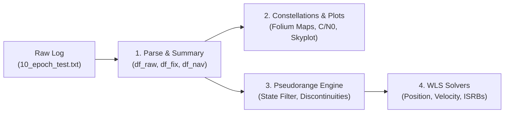

# GNSS Analysis with AI Skills

[](https://colab.research.google.com/github/google/gps-measurement-tools/blob/master/gnss_analysis_with_skills/gnss_analysis_with_skills.ipynb)
[](https://opensource.org/licenses/Apache-2.0)
[](https://www.python.org/)
[](https://www.ion.org/gnss/abstracts.cfm?paperID=17137)

Create custom, multi-constellation and multi-band GNSS data analysis and
visualization tools in minutes using Large Language Models (LLMs) and
domain-specific **AI Skills**.

This project provides an interactive **Google Colab notebook** with
pre-configured AI custom instructions and a standalone **Agent Skill
(`SKILL.md`)** that guide LLMs (such as Gemini, Claude, and GPT) to reliably
parse raw Android `GnssLogger` logs, compute multi-GNSS pseudoranges, generate
interactive maps and skyplots, and solve Weighted Least Squares (WLS) positions
and velocities with Inter-Signal Range Biases (ISRBs).

This work accompanies the paper and presentation delivered at
**[ION GNSS+ 2026](https://www.ion.org/gnss/abstracts.cfm?paperID=17137)**:

> **"Months to Minutes: Creating GNSS Analysis Tools at the Speed of AI"** \
> *Frank van Diggelen, Sean Barbeau, Jennifer Wang, Mohammed Khider, Imad
> Fattouch, and Dave Orendorff* \
> 📄
> **[Read the Paper](https://docs.google.com/document/d/1KNs89wFUSbWoLcYaDPPVcN1nikrmeplu/edit?resourcekey=0-38bv4m3HwRJXHA-oLZfrBA#heading=h.tjcq8xng031f)**
> | 📊
> **[View the Presentation](https://docs.google.com/presentation/d/1-0uRvBQ_vASOPaOEq_a07zA0IjVH78d1aK6ky5SFwXY/edit?slide=id.g3fb175d651a_32_16#slide=id.g3fb175d651a_32_16)**
> | 🌐
> **[Official Listing](https://www.ion.org/gnss/abstracts.cfm?paperID=17137)**

--------------------------------------------------------------------------------

## 🎬 Demo


*Timelapse: Creating a complete GNSS analysis Colab notebook in under 5 minutes
using the provided template Colab with embedded custom instructions.*

--------------------------------------------------------------------------------

## ⚡ Quickstart

Run a complete multi-constellation GNSS analysis pipeline in your browser in
under a minute:

1.  **Launch the Notebook**: Click the
    **[Open in Colab](https://colab.research.google.com/github/google/gps-measurement-tools/blob/master/gnss_analysis_with_skills/gnss_analysis_with_skills.ipynb)**
    badge.
2.  Follow the instructions in the colab to select the custom instructions and
    prompt Gemini.

--------------------------------------------------------------------------------

## 🚀 Key Features

*   **Multi-Constellation & Multi-Band**: Complete support for GPS, GLONASS,
    Galileo, BeiDou, QZSS, and SBAS across `L1`, `L5`, `E1`, `E5a`, `E5b`, `G1`,
    `G2`, `B1I`, `B1C`, `B2a`, `B2b`, and `B3` frequency bands.
*   **Robust Log Parsing**: Dynamic extraction of `# Raw`, `# Fix`, and `# Nav`
    byte stream sentences.
*   **Vectorized Pseudorange Engine**: Vectorized nanosecond clock mathematics
    anchored to `HardwareClockDiscontinuityCount`, strict 64-bit float
    precision, Android API state flag filtering, and GLONASS Moscow Time / leap
    second alignment.
*   **WLS Position & Velocity Solvers**: Simultaneous Weighted Least Squares
    solver weighted by 1 / σ<sub>PR</sub><sup>2</sup>, estimating 3D ECEF
    position, receiver clock bias, and per-signal Inter-Signal Range Biases
    (ISRBs) with Sagnac Earth-rotation correction, plus Doppler-based velocity
    estimation.
*   **Interactive Visualizations**: Interactive Folium maps with layer controls
    (GPS, FLP, NLP, WLS fixes), Plotly C/N<sub>0</sub> facet histograms,
    stairs-style satellite tracking, Colab Form parameter explorers, and
    vectorized polar skyplots via `pymap3d.ecef2aer`.
*   **Agent-Ready (`SKILL.md`)**: Reusable standalone skill definition
    compatible with Cursor, Claude Code, GitHub Copilot, Gemini CLI, and custom
    agentic frameworks.

--------------------------------------------------------------------------------

## 🔬 Why AI Skills? (The Research)

Developing raw GNSS analysis software has historically required months of
specialized engineering effort. While modern Large Language Models (LLMs) excel
at generic Python data science, they struggle with the intricate domain nuances
of [raw GNSS measurements from Android phones](https://g.co/gnsstools).

### The Challenge: Domain Pitfalls

When prompting state-of-the-art LLMs **without domain guidance**, code
generation frequently fails due to:

*   **Precision Loss**: Truncating 64-bit nanosecond clock fields (`TimeNanos`,
    `FullBiasNanos`) into 32-bit floats or integers, causing kilometers of
    position error.
*   **Receiver Clock Discontinuities**: Failing to anchor clock biases when the
    receiver hardware clock resets.
*   **Mixed Time Systems**: Treating GLONASS Time of Day (Moscow Time UTC+3) as
    GPS Time of Week without accounting for leap seconds.
*   **Inter-Signal Range Biases (ISRBs)**: Overlooking hardware delays across
    constellations and frequencies, leading to poor multi-GNSS fixes.

### The Solution & Benchmark Results

By encapsulating Android GNSS domain expertise into modular **AI Skills**, code
generation reliability improves dramatically across 3,500 empirical test
executions:

Metric                 | Baseline LLM (No Skills) | LLM + AI Skills    | Improvement
:--------------------- | :----------------------: | :----------------: | :---------:
**Pass Rate**          | 79.1%                    | **99.9%**          | **+20.8%** (100% Bayesian confidence)
**Flakiness Score**    | High variance            | **0.04**           | Near-deterministic execution
**Assertion Failures** | 731 / 3,500 runs         | **3 / 3,500 runs** | **99.6% reduction**
**Execution Time**     | Baseline                 | **~25% faster**    | Streamlined code generation
**Token Consumption**  | Baseline                 | **~19% lower**     | Concise, targeted prompting

--------------------------------------------------------------------------------

## 📁 Repository Structure

File                                                                         | Description
:--------------------------------------------------------------------------- | :----------
[`gnss_analysis_with_skills.ipynb`](gnss_analysis_with_skills.ipynb)         | **Interactive Colab Notebook**: Pre-loaded with 4 modular AI Custom Instructions in `metadata.colab.aiContexts`.
[`SKILL.md`](SKILL.md)                                                       | **Universal Agent Skill**: Complete domain specification with YAML frontmatter for AI coding assistants.
[`10_epoch_test.txt`](10_epoch_test.txt)                                     | **Sample Benchmark Dataset**: 10-epoch raw Android `GnssLogger` measurement log from a Google Pixel 10 under open sky.

--------------------------------------------------------------------------------

## 🧠 What the Skills Cover

The skills structure the GNSS analysis pipeline into four logical, modular
stages:



### 1. Log Parsing & Dynamic Headers

*   Extracts `# Raw`, `# Fix`, and `# Nav` metadata headers dynamically.
*   Pads and truncates rows to accommodate variable trailing comma formats
    across Android `GnssLogger` versions.
*   Extracts variable-length navigation message payloads into structured
    `df_nav_full` byte lists.

### 2. Constellation & Frequency Mapping

*   Maps numeric `ConstellationType` IDs to names (`GPS`, `GLONASS`, `Galileo`,
    `BDS`, `QZSS`, `SBAS`).
*   Categorizes carrier frequencies into standard bands (`L1`, `L5`, `E1`,
    `E5a`, `E5b`, `G1`, `G2`, `B1I`, `B1C`, `B2a`, `B3`) using frequency
    tolerance matching.

### 3. Vectorized Pseudoranges

*   Anchors `StableFullBiasNanos` to `HardwareClockDiscontinuityCount` using
    vectorized pandas transforms.
*   Enforces strict `float64` nanosecond math for receiver time (`tRxNanos`) and
    week calculation.
*   Applies constellation-specific tracking status masks (`STATE_CODE_LOCK`,
    `STATE_TOW_DECODED`, `STATE_GLO_TOD_DECODED`,
    `STATE_GAL_E1C_2ND_CODE_LOCK`).
*   Handles GLONASS time-of-day offset and leap seconds modulo 86,400 s.

### 4. Weighted Least Squares (WLS) Position & Velocity with ISRBs

*   Formulates simultaneous WLS position estimation weighted by measurement
    uncertainty (w<sub>i</sub> = 1 / σ<sub>PR,i</sub><sup>2</sup>).
*   Solves jointly for 3D coordinates (X, Y, Z), common receiver clock offset
    (dt<sub>rx</sub>), and per-signal Inter-Signal Range Biases
    (ISRB<sub>m</sub>) relative to the dominant reference signal.
*   Incorporates Earth rotation Sagnac effect corrections.
*   Solves receiver velocity (V<sub>x</sub>, V<sub>y</sub>, V<sub>z</sub>) and
    clock frequency drift from Doppler pseudorange rates.

--------------------------------------------------------------------------------

## 🛠️ Usage Workflows

### Option 1: In Google Colab (Recommended for Interactive Analysis)

1.  Open
    [`gnss_analysis_with_skills.ipynb`](https://colab.research.google.com/github/google/gps-measurement-tools/blob/master/gnss_analysis_with_skills/gnss_analysis_with_skills.ipynb)
    in Colab.
2.  Verify the pre-loaded instructions under **AI -> Customize AI -> Custom
    instructions**.
3.  Use the chat window to request specific analyses, plots, or filters.

### Option 2: With AI Coding Assistants & IDEs

You can use [`SKILL.md`](SKILL.md) directly with AI tools like Cursor, Claude
Code, GitHub Copilot, or Gemini CLI:

*   **Cursor**: Add `SKILL.md` to your project's `.cursorrules` or reference it
    using `@SKILL.md` in chat.
*   **Claude Code**: Include `SKILL.md` in your project root or pass it in via
    context instructions.
*   **GitHub Copilot**: Reference `#file:SKILL.md` in Copilot Chat in VS Code.
*   **Python Scripts / JupyterLab**: Point your AI assistant to `SKILL.md` to
    generate standalone analysis scripts for batch processing large GNSS
    campaigns.

--------------------------------------------------------------------------------

## 📚 References & Citation

If you use this work, notebook, or skill in your research, please cite our ION
GNSS+ 2026 paper:

```bibtex
@inproceedings{vandiggelen2026months,
  title={Months to Minutes: Creating GNSS Analysis Tools at the Speed of AI},
  author={van Diggelen, Frank and Barbeau, Sean and Wang, Jennifer and Khider, Mohammed and Fattouch, Imad and Orendorff, Dave},
  booktitle={Proceedings of the 39th International Technical Meeting of the Satellite Division of The Institute of Navigation (ION GNSS+ 2026)},
  year={2026},
  url={https://www.ion.org/gnss/abstracts.cfm?paperID=17137}
}
```

*   **Official Conference Abstract**:
    [ION Paper ID 17137](https://www.ion.org/gnss/abstracts.cfm?paperID=17137)
*   **Full Paper**:
    [Google Docs Link](https://docs.google.com/document/d/1KNs89wFUSbWoLcYaDPPVcN1nikrmeplu/edit?resourcekey=0-38bv4m3HwRJXHA-oLZfrBA#heading=h.tjcq8xng031f)
*   **Presentation Slides**:
    [Google Slides Link](https://docs.google.com/presentation/d/1-0uRvBQ_vASOPaOEq_a07zA0IjVH78d1aK6ky5SFwXY/edit?slide=id.g3fb175d651a_32_16#slide=id.g3fb175d651a_32_16)
*   **Android GNSS Tools**: [https://g.co/gnsstools](https://g.co/gnsstools)

--------------------------------------------------------------------------------

## 📄 License

This project is part of the
[google/gps-measurement-tools](https://github.com/google/gps-measurement-tools)
repository and is licensed under the
[Apache License, Version 2.0](https://www.apache.org/licenses/LICENSE-2.0).
